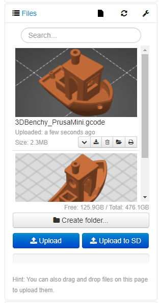

# PrusaSlicer Thumbnails

This plugin will extract the embedded thumbnails from PrusaSlicer gcode files where the printer's profile ini file has the thumbnail option configured. This is default behavior for the Prusa Mini printer profile. 

The thumbnail image extracted will always be the last resolution provided in the thumbnail setting. So for example the Prusa Mini setting is `thumbnails = 16x16,220x124` so the thumbnail that will be extracted will be 220x124 pixels as seen in the screenshots below. Check the Configuration section below for additional details.

The preview thumbnail can be shown in OctoPrint from the files list by clicking the newly added image button.

The thumbnail will open in a modal window.

If enabled in settings the thumbnail can also be embedded as an inline thumbnail within the file list itself. If you use this option it's highly recommended to use Themeify to make the file list taller by adding the below custom style.

| Selector                                            | CSS_Rule   | Value            |
|-----------------------------------------------------|------------|------------------|
| #files > div > div.gcode_files > div.scroll-wrapper | min-height | 800px !important |

## Configuration

Since PrusaSlicer only enables thumbnails by default for the Prusa Mini you may need to manually update your configuration files. Those can be found by selecting `Show Configuration Folder` from the Help menu of the application and then inside the printers sub-folder you'll find your printer profiles. 

**Note:** If you don't see your printer's ini file in the printers sub-folder; you are probably using one of the bundled Prusa Printer profiles (ie MK3S). If so you may need to create a copy of this printer profile to be able to have an ini file to edit. To do this in PrusaSlicer go to the Printer Settings tab and Click the save button next to the printer list and give it a new name. Alternatively, push Prusa Research to update their bundled profiles to match the Mini by commenting in the issue posted on their repository [here](https://github.com/prusa3d/PrusaSlicer/issues/3488).

Open your desired printer profile in your favorite text editor and find the `thumbnails =` section and add the resolution that you would like to include in your sliced files, and therefore visible by this plugin. For example `thumbnails = 16x16,220x124` will be the equivalent of the Prusa Mini as described above. 

**Note:** Once you've made your changes you will need to restart PrusaSlicer in order for the changes to be used and embed the thumbnails in the exported gcode files.

**Warning**: the higher the resolution of the thumbnail you enter in this setting the larger your gcode file will be when sliced.

## Get Help

If you experience issues with this plugin or need assistance please use the issue tracker by clicking issues above.

### Additional Plugins

Check out my other plugins [here](https://plugins.octoprint.org/by_author/#jneilliii)

### Sponsors
- Andreas Lindermayr
- [@Mearman](https://github.com/Mearman)
- [@TxBillbr](https://github.com/TxBillbr)
- Gerald Dachs
- [@TheTuxKeeper](https://github.com/thetuxkeeper)
- @tideline3d
- [SimplyPrint](https://simplyprint.dk/)

### Support My Efforts
I, jneilliii, programmed this plugin for fun and do my best effort to support those that have issues with it, please return the favor and leave me a tip or become a Patron if you find this plugin helpful and want me to continue future development.

 

<small>No paypal.me? Send funds via PayPal to jneilliii&#64;gmail&#46;com</small>
